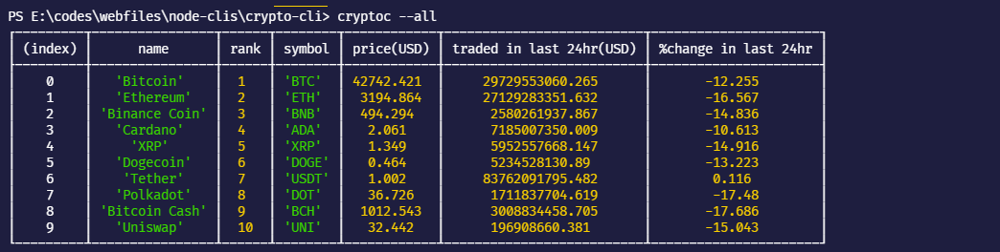
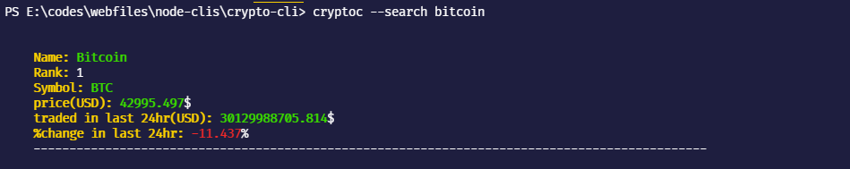
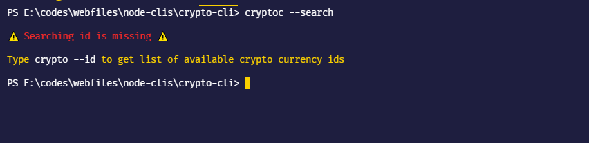
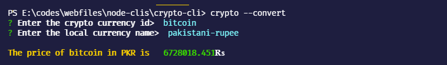
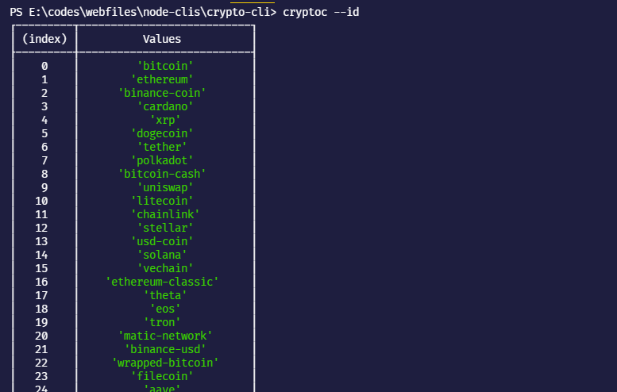

A tool to keep track of crypto currency right from your terminal.

---
## ⚡ Features

- 🔎 Search about a particular currency
- 💱 Convert the USD value of currency into your local currency.

## 🔻 Installation
Install the CLI globally by typing following command.

    npm i -g @meerhamza1421/crypto-currency-cli

## ⚙️ Usage

You can use the cli by typing 

    cryptoc --flags

### 🏁 flags
### --all or -a:
This flag used to display the top 10 crypto currencies in a the form of a table.

    cryptoc --all

you can perform same operation using -a flag.

### --search or -s:
This flag used to search a particular crypto currency through their id.

    cryptoc --search id

you can perform the same thing with -s flag.

⚠️ if you omit id of the currency. You should received this error message.

### --convert or -c:

This flag used to convert the current price of a crypto currency from USD to user-mentioned currency.

    cryptoc --convert

You can convert a crypto price from USD to 181 different currencies (fiat or another crypto currency).

⚠️ You shouldn't give the spaces between currency name, replace spaces with hyphen **-** like instead of **pakistani rupee** you should write it as **pakistani-rupee**.

### --id:

This flag shows the ids of the available crypto currencies (100 at this moment) in the form of a table. The id is needed for the searching.

    cryptoc --id

## 👨‍💻 Author
Yo👋 it's Meer, an aspiring full stack developer and an undergrad student.
You can follow me at

- [Twitter](https://twitter.com/MeerHamza1421)
- [DEV](https://dev.to/meerhamza1421)

>Spare a star ⭐ if you like this project
